<<<<<<< HEAD
# shopify-contents-pallet
ShopifyでIKEA風コンテンツパレットを再現するテーマセクション（Liquid + CSS + JS）
=======
# Shopify Contents Pallet

---

2024年度 イケアの公式オンラインストア風のコンテンツプレビューデザインです。  
Liquid + CSS + JavaScript でシンプルに実装しています。  
**保守性・運用性を高めるため、カスタムフィールド（メタオブジェクト）の更新のみでデザインが反映される構造**にしています。

---

## 🚀 使用方法

1. `sections/contentspallet01.liquid` をテーマに追加  
2. `assets/contentspallet01_frame.css` をテーマに追加  
3. `assets/contentspallet01_pub.css` をテーマに追加  
4. `assets/contentspallet01_pip.css` をテーマに追加  
5. `assets/contentspallet01.js` をテーマに追加  
6. `templates/index.json` のスキーマ `order` に `contentspallet01` を追加  
7. カスタムフィールド（メタオブジェクト）を定義  
8. テーマエディタでセクションを追加し、反映したいパレットを設定

---

## 💻 完成ビューサンプル

| PCビュー |
|-----------|
PCの完成プレビューサンプルです。
| 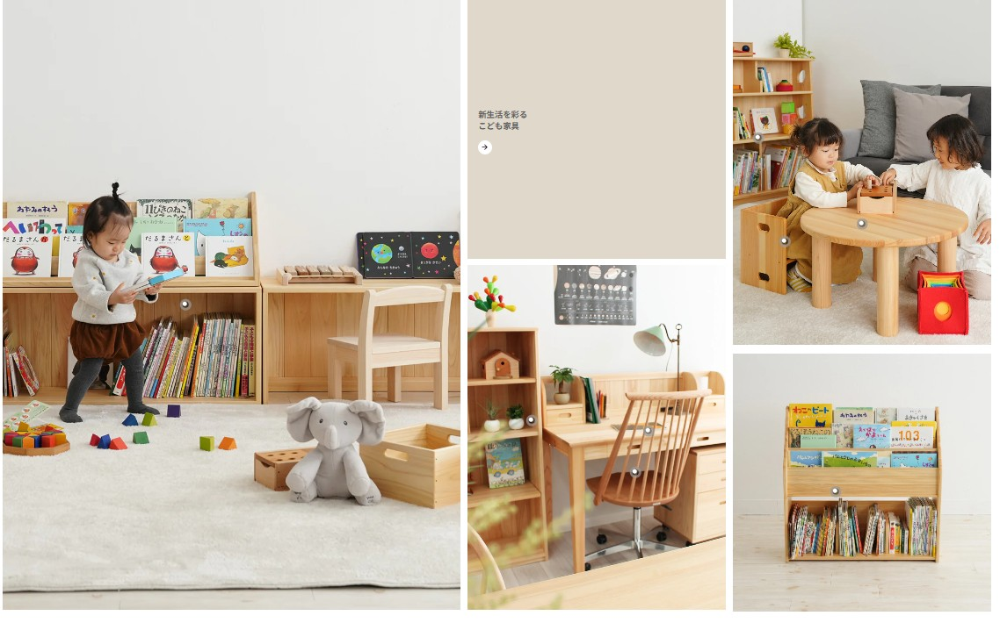 |
画像内のドットをマウスオーバーしたら詳細ラベルがポップアップします。
| 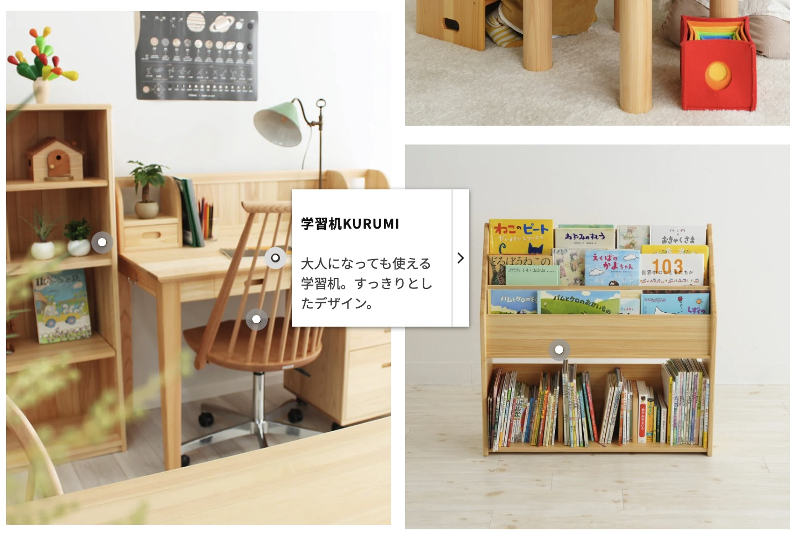 |

| スマホビュー |
|-----------|
スマホの完成プレビューサンプルです。
| 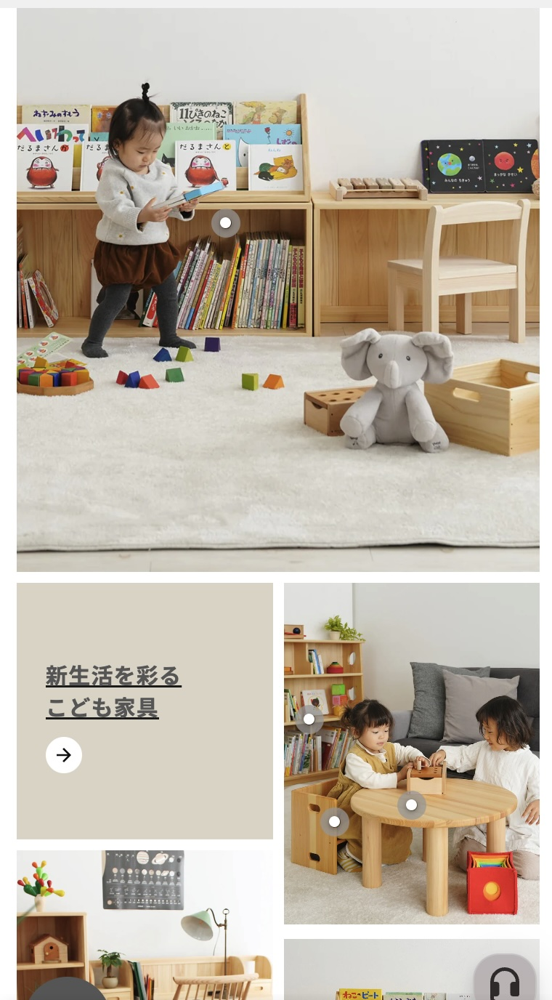 |
| 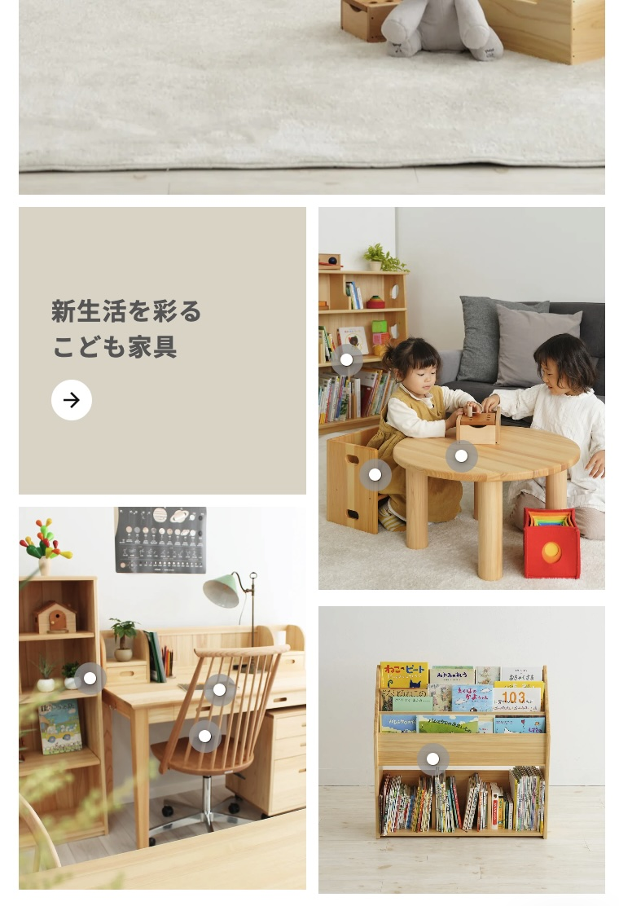 |
画像内のドットをタップしたら詳細ラベルがポップアップします。
| 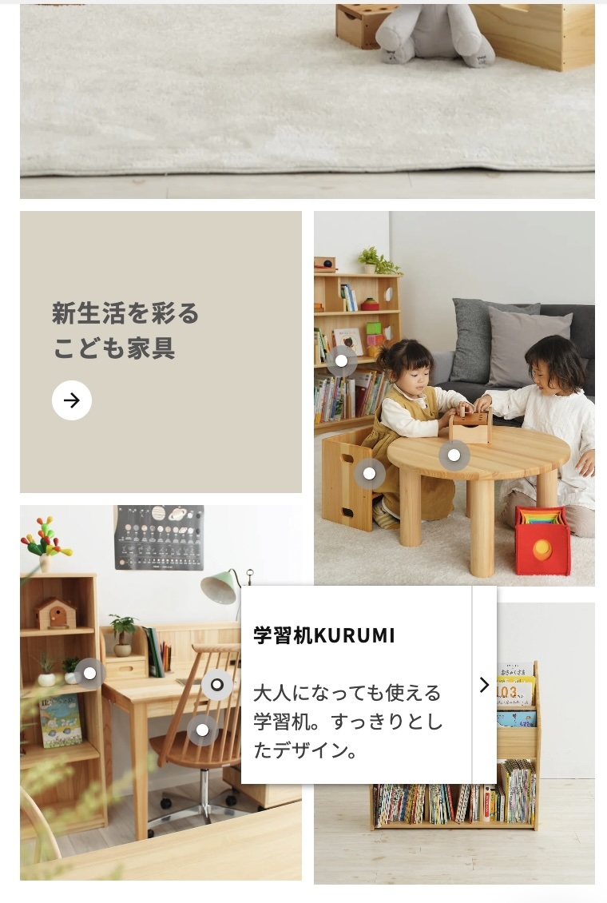 |

---

## 🧩 メタオブジェクト構成

### 🪄 contents_pallet_parent メタオブジェクト定義
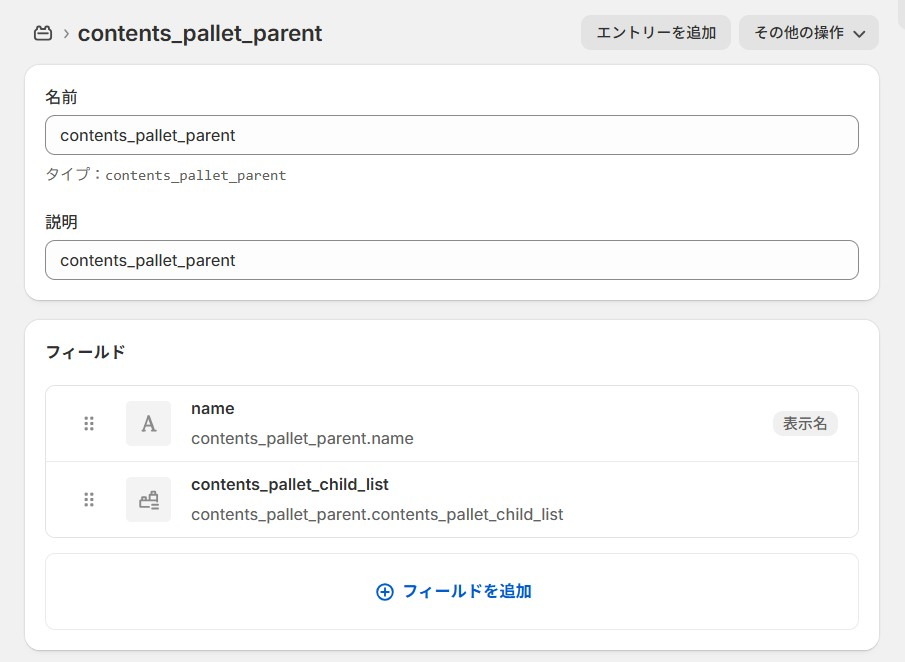

### 📋 contents_pallet_parent メタオブジェクトサンプル
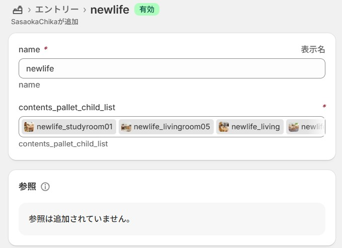

---

### 🧩 contents_pallet_child メタオブジェクト定義
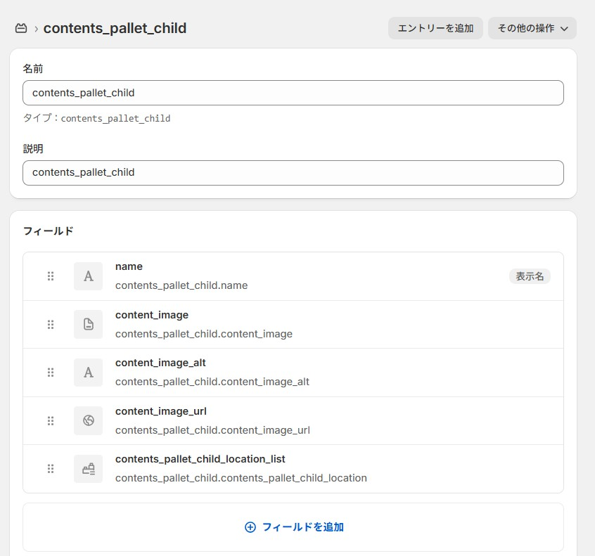

### 📋 contents_pallet_child メタオブジェクトサンプル
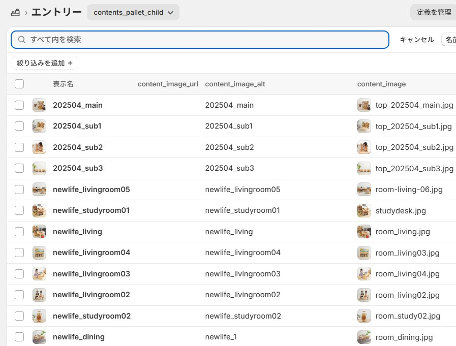

---

### 🗺️ contents_pallet_child_location_display_type メタオブジェクト定義
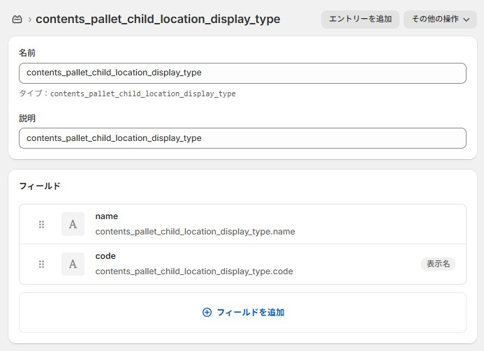

### 📋 contents_pallet_child_location_display_type メタオブジェクトサンプル
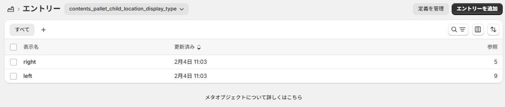

---

## 🧑‍💻 作者

**Ryohma U.**  
ポートフォリオ：[https://www.rnsystem.jp](https://www.rnsystem.jp)

---

> 💡 **補足**  
> このコードは教育・学習目的で公開しています。  
> 実運用時は必ずテーマ構成やメタオブジェクト名を各店舗環境に合わせて変更してください。
>>>>>>> f916c8e (Add all Shopify Contents Pallet files)
